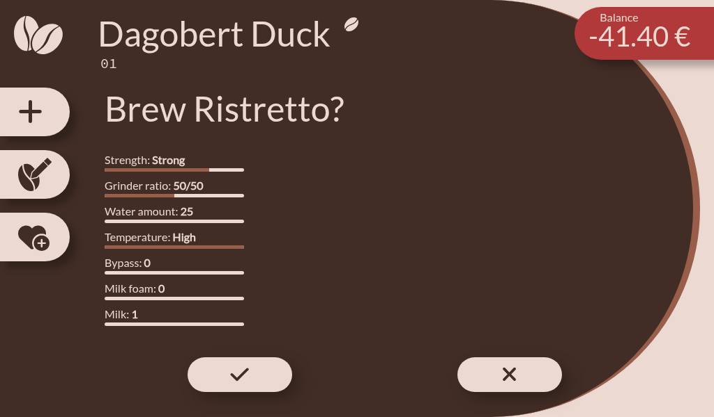
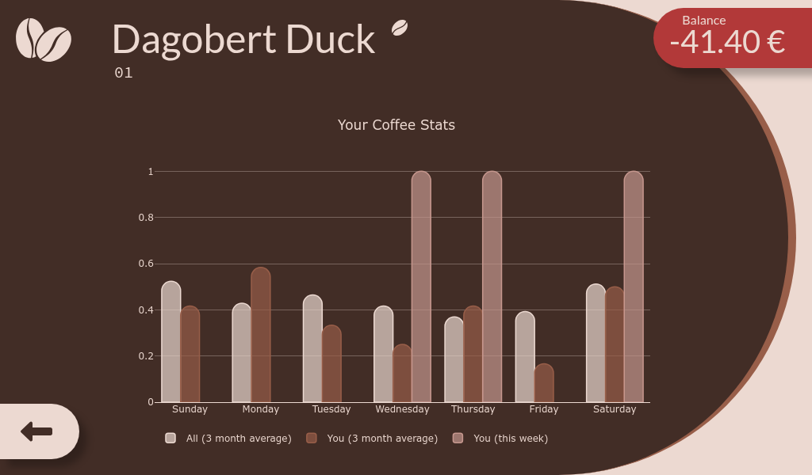

# Help and User Manual

- [Help and User Manual](#help-and-user-manual)
  - [Web Pages](#web-pages)
    - [Welcome](#welcome)
      - [Actions](#actions)
    - [Select User](#select-user)
    - [Coffee](#coffee)
      - [Actions](#actions-1)
    - [Brew](#brew)
      - [Actions](#actions-2)
    - [Edit/New Coffee](#editnew-coffee)
      - [Actions](#actions-3)
    - [Pay](#pay)
    - [Edit User](#edit-user)
      - [Actions](#actions-4)
        - [Update Tag](#update-tag)
        - [Fill from email](#fill-from-email)
        - [Options](#options)
    - [Statistics](#statistics)

## Web Pages

### Welcome

On the welcome page, you can see the coffee statistics over the last months.

#### Actions

- Put your card on the reader to log in or to register.
- </img>
  **Select User**:
  Click to open the list of all users.
  [More...](#select-user)
- </img>
  **Guest**:
  Click if you are a guest and have no user account.
- </img>
  **Settings**:
  Go to Coffeebuddy's settings page.

### Select User

On this page you can select a user from the list of all users.
Users are sorted by their last name.

The most frequently used users are displayed at the top of the list.

### Coffee

If Coffeebuddy controls the coffeemaker, you can select the desired coffee products.
Otherwise you can "buy" a coffee by clicking on the coffee cup.

Below your name you can see your tag ids.

On the top right you see your balance:
A positive value means you have credit, a negative value means you owe money.

#### Actions

- </img>
  **Pay**:
  Click to pay your debt.
  [More...](#pay)
- </img>
  **Edit User**:
  Click to edit your user data.
  [More...](#edit-user)
- </img>
  **Statistics**:
  Click to see your coffee statistics.
  [More...](#statistics)

### Brew

Only available if Coffeebuddy controls the coffeemaker.

#### Actions

- </img>
  **Ok**:
  Click to start brewing.
- </img>
  **Abort**:
  Click to go back to the coffee selection.
- </img>
  **New**:
  Click to derive a new coffee product from the current selection.
  [More...](#editnew-coffee)
- </img>
  **Edit Coffee**:
  Click to edit the current coffee product.
  Only available if it is a derived coffee product.
  [More...](#editnew-coffee)
- </img> / </img>
  **Add or remove from favorites**:
  Click to add or remove the current coffee product from your favorites.

### Edit/New Coffee

On this page you can edit the current coffee product.

The name of the coffee product can be adjusted by clicking on the text field.
Use the sliders to adjust the values.

#### Actions

- </img>
  **Save**:
  Click to save your changes.
- </img>
  **Save**:
  Click to delete the current coffee product.
  Only available if it is a derived coffee product.

### Pay

On this page you can record a payment.

### Edit User

This page allows you to edit your user data.

#### Actions

##### Update Tag

Click on "Update Tag" to update your primary or secondary tag.

##### Fill from email

Enter your "E-Mail" and click on "Fill from email" to fill in your first and last name according your corresponding WebEx account.

##### Options

- Oneswipe:
  The "oneswipe" feature allows you to buy a coffee by just swiping your tag once.
  It is only available if Coffeebuddy does not control the coffeemaker.

### Statistics

